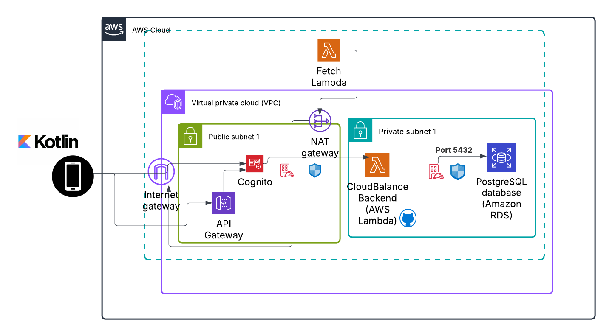

# cloud-balance-backend

This is the backend service for the **Cloud Balance** project, a cloud optimization tool that fetches, stores, and manages AWS cost and resource data for authenticated users. The backend is built using **Node.js**, **Express**, and **PostgreSQL**, and is deployed as an AWS Lambda function with an API Gateway and Cognito integration for secure access.

---

## 🚀 Features

- **User Management** (Create, Read, Update, Delete users)
- **IAM Role Management** (Store roles used for cross-account access)
- **AWS Data Fetching** via Lambda STS role assumption
- **Store AWS Costs and Resources** (e.g., EC2, cost explorer)
- **Alerts System** for triggering notifications
- **JWT Authentication via Amazon Cognito**
- **Serverless Deployment via Terraform**
- **Mocha Test Suite** for integration & route testing
- **PostgreSQL** for persistent data storage

---

## 📂 Project Structure

```
src/
  config/               # DB config
  controllers/          # Route handlers for users, resources, alerts, AWS fetch
  routes/               # API endpoints
  index.js              # Main Express app

tests/
  *.test.js             # Mocha + Chai tests for each route group
  hooks/global-teardown.js
```

---

## 🧪 Running Locally

### 1. Install Dependencies

```bash
npm install
```

### 2. Create `.env` File

```bash
cp .env.test .env
```

### 3. Set Up Local PostgreSQL

Use Docker or local PostgreSQL. Or run the SQL script:

```bash
psql -U testuser -d cloud_balance_test -f scripts/setup-test-db.sql
```

### 4. Run Tests

```bash
npm test
```

---

## 🛠 Deployment (via Terraform)

```bash
# Zip code before deploy
zip -r ../terraform-aws-backend/lambda.zip src node_modules package.json

# Run Terraform apply
cd ../terraform-aws-backend
terraform apply -auto-approve
```

---

## 📦 API Endpoints

| Method | Endpoint                  | Description                     |
|--------|---------------------------|---------------------------------|
| GET    | /api/users                | List all users                  |
| POST   | /api/users                | Create new user                 |
| PUT    | /api/users/:id            | Update user                     |
| DELETE | /api/users/:id            | Delete user                     |
| POST   | /api/iam-roles            | Save IAM role                   |
| GET    | /api/iam-roles/:user_id   | Get IAM role by user ID         |
| POST   | /api/aws/fetch/:user_id   | Invoke Lambda and save data     |
| GET    | /api/resources            | List all AWS resources          |
| POST   | /api/alerts               | Create alert                    |
| GET    | /api/alerts               | List all alerts                 |

---

## ✅ Tests

Includes unit and integration tests for:

- User routes
- IAM role routes
- Resource routes
- AWS fetch
- Alerts
- Database connection and teardown

Run tests with:

```bash
npm test
```

---

## 🔐 Authentication

- Integrated with Amazon Cognito
- JWT authorizer on API Gateway routes
- Tokens required in Authorization headers

---

## System Architecture

The diagram below illustrates how the Cloud Balance mobile app, backend API, AWS Lambda functions, and PostgreSQL database interact across public and private cloud environments.



---

## 📄 License

MIT — see [LICENSE](LICENSE) for details.

---

## ✨ Credits

Part of the **Cloud Balance** final year project.
Maintained by [Kate](https://github.com/katmolony).
